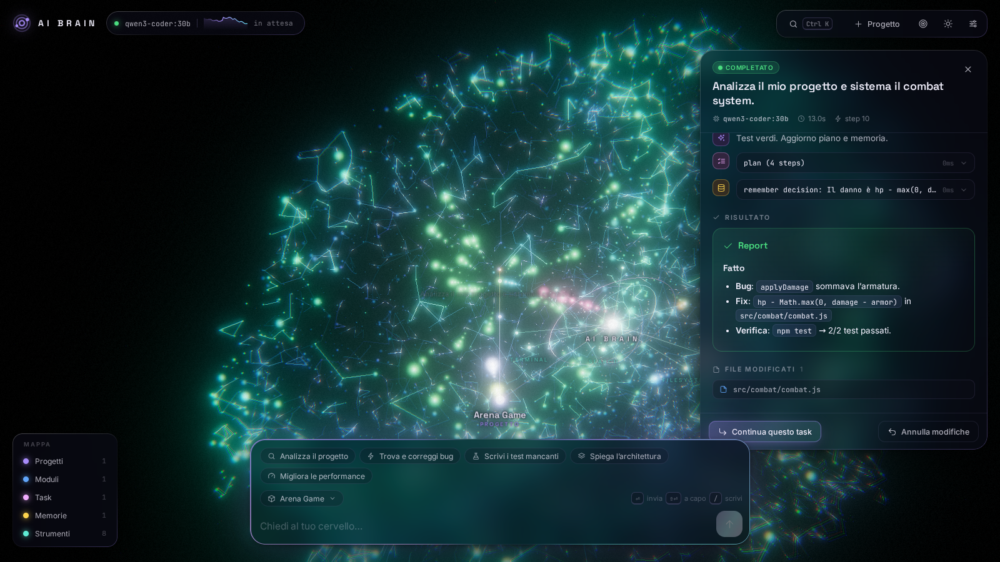
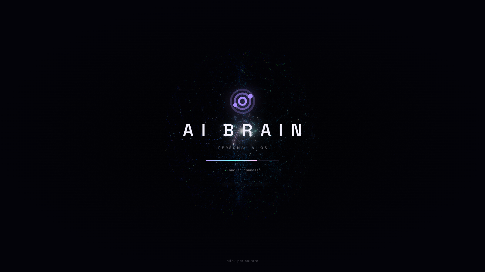
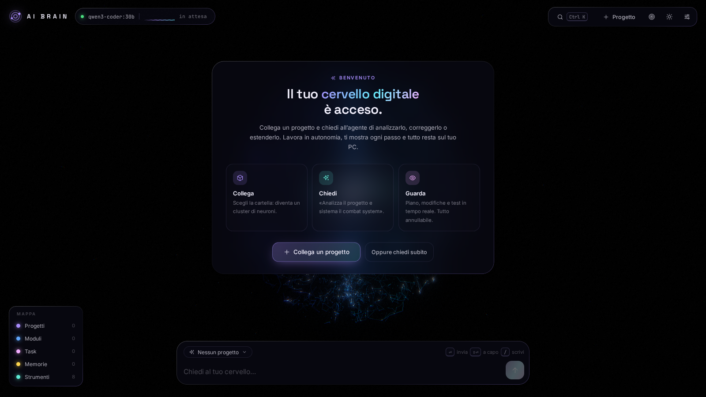
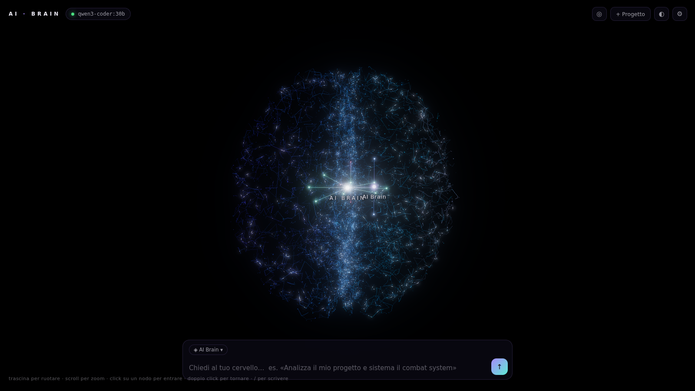
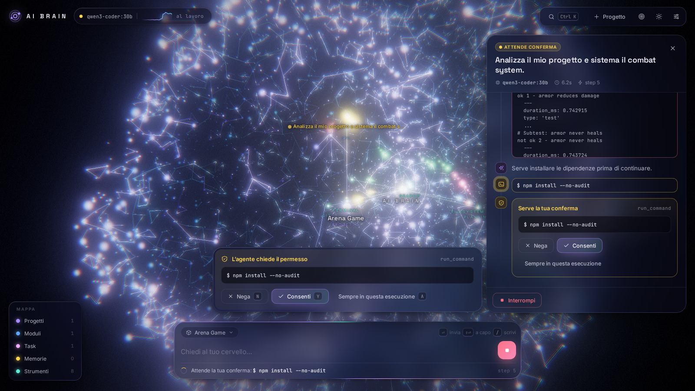
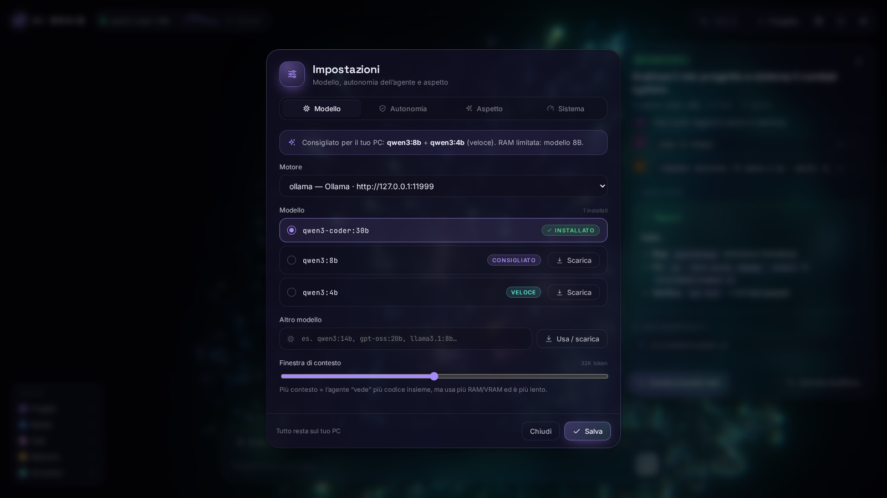
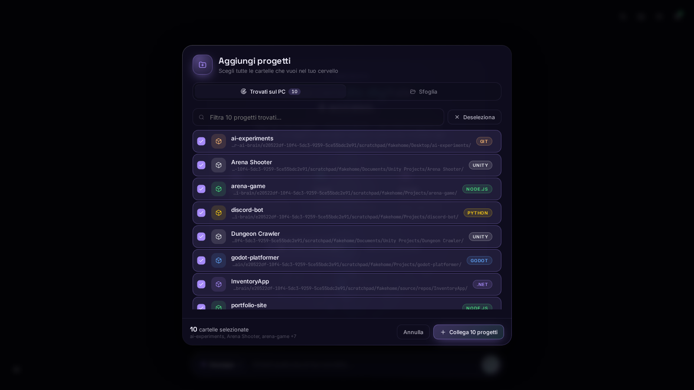

# 🧠 AI Brain — Personal AI OS locale

Un cervello digitale 3D che gira **interamente sul tuo PC**: migliaia di neuroni vivi, cluster per progetti, task, memoria e strumenti, e un **agente di coding autonomo** che legge e modifica codice, usa il terminale, esegue i test, corregge gli errori e ti mostra in tempo reale cosa sta facendo. Niente API a pagamento: usa un LLM open‑source locale tramite Ollama o llama.cpp.



| Intro | Benvenuto |
|---|---|
|  |  |
| **Suggerimenti e nucleo** | **Conferma prima di un'azione rischiosa** |
|  |  |
| **Impostazioni (modelli consigliati per il tuo PC)** | **Aggiungi progetti (selezione multipla)** |
|  |  |

---

## Cosa fa (V1)

**Cervello 3D**
- ~12.000 neuroni a forma di cervello (due emisferi, cervelletto, tronco) con sinapsi; impulsi che corrono sulle sinapsi, tutto animato su GPU
- cluster semantici: **nucleo**, 8 **lobi strumenti** (filesystem, ricerca, terminale, git, test, web, memoria, pianificazione), **progetti** con i loro **moduli**, **task** e **ricordi**
- quando l'agente lavora gli impulsi viaggiano nucleo → lobo dello strumento → progetto → task; il campo neurale si accende in base all'attività
- camera cinematografica (volo morbido verso i nodi, auto‑rotazione a riposo), bloom, tema scuro/chiaro
- click su un nodo = ci entri (pannello di dettaglio); pannelli minimal che compaiono solo quando servono

**Agente**
- legge/crea/modifica/elimina file, analizza l'intera codebase (indice con linguaggi, framework, simboli), cerca nel codice (ripgrep)
- usa il terminale, esegue i test (auto‑rilevati: npm/pnpm/yarn, pytest, cargo, go, dotnet, make), usa Git (status/diff/log/branch/commit — **mai push**)
- web search + lettura pagine (senza API key)
- ciclo autonomo multi‑step: **analizza → pianifica → modifica → testa → correggi → verifica → report**; se modifica file senza verificarli, l'orchestratore lo obbliga a farlo
- **chiede conferma** prima di azioni rischiose (eliminazioni, comandi non banali, commit); le azioni distruttive chiedono *sempre*
- **ogni modifica è annullabile**: snapshot automatico dei file prima di toccarli → pulsante “Annulla modifiche”
- memoria persistente di progetti, decisioni, fatti, idee, preferenze e task (le richieste successive ne tengono conto)
- streaming live di pensieri, piano, strumenti, output del terminale

---

## Modello e runtime scelti per il tuo hardware

**Hardware:** Ryzen 7 5800X · RX 6650 XT 8 GB · 64 GB RAM.

| Ruolo | Modello (Ollama) | Perché |
|---|---|---|
| **Principale** | `qwen3-coder:30b` (Qwen3‑Coder‑30B‑A3B, ~19 GB Q4) | Modello *specializzato in coding agentico* con tool‑calling nativo. È un **MoE**: 30B parametri ma solo ~3B attivi per token, quindi pur non entrando negli 8 GB di VRAM gira bene con parte dei pesi nei tuoi 64 GB di RAM. Il miglior rapporto qualità/velocità per il tuo PC. |
| Veloce (opzionale) | `qwen3:8b` (~5 GB) | Sta tutto in VRAM → molto più rapido per domande e task semplici. Provider `ollama-fast`. |
| Alternativa | `gpt-oss:20b` | Altro MoE forte nel tool‑calling, se vuoi confrontare. |

**Runtime: Ollama** (default) — semplice, gestisce download/quantizzazione e offload GPU+CPU da solo, API con tool‑calling nativo. **llama.cpp** (`llama-server`, build *Vulkan*) è supportato come alternativa tramite il provider `llama-cpp` (API OpenAI‑compatibile) se vuoi il massimo controllo (es. `--n-cpu-moe`).

> **GPU AMD su Windows.** La RX 6650 XT (gfx1032) non è supportata ufficialmente da ROCm su Windows; Ollama la usa tramite **Vulkan**. Nelle versioni 0.30.x c'è un bug noto per cui il loader Vulkan incluso in Ollama non vede la 6650 XT e tutto gira su CPU ([ollama/ollama#16677](https://github.com/ollama/ollama/issues/16677)). Controlla con `npm run doctor` (mostra la % del modello in VRAM) o `ollama ps`. Se vedi `100% CPU`, il workaround è far usare a Ollama il loader Vulkan di sistema (da ripetere dopo ogni aggiornamento di Ollama):
> ```powershell
> Rename-Item "$env:LOCALAPPDATA\Programs\Ollama\lib\ollama\vulkan\vulkan-1.dll" "vulkan-1.dll.bak"
> ```
> `AI-Brain.bat` lo controlla e lo corregge da solo. In alternativa usa la build Vulkan di llama.cpp (vedi sotto).

---

## Avvio in un doppio click (Windows)

1. Scarica/clona questa cartella.
2. Doppio click su **`AI-Brain.bat`**. Fine.

Al primo avvio fa tutto da solo, mostrando ogni passo con barre di progresso:

| Passo | Cosa fa |
|---|---|
| Hardware | rileva CPU, RAM e GPU (con la **VRAM reale**, letta dal driver) |
| Modelli | sceglie i modelli migliori per il tuo PC (per il tuo: `qwen3-coder:30b` + `qwen3:8b`, contesto 32K) e scrive `brain.config.json` |
| Strumenti | installa **Node.js LTS**, **Git** e **ripgrep** con `winget` se mancano |
| Motore AI | installa **Ollama** se manca, lo avvia (con flash‑attention e KV cache compressa) |
| Download | scarica i modelli con barra di avanzamento, velocità ed ETA (riprende se si interrompe) |
| GPU | carica il modello e misura quanta parte sta in VRAM; con **GPU AMD** applica da solo la correzione nota di Ollama/Vulkan se serve (e la annulla se non aiuta) |
| App | installa le dipendenze e ricompila **solo se qualcosa è cambiato** |
| Avvio | avvia il server e apre il cervello nel browser |

Dal secondo avvio impiega pochi secondi. Lascia aperta la finestra (Ctrl+C per spegnere); se AI Brain è già acceso, il `.bat` apre solo il browser.

Opzioni: `AI-Brain.bat --reconfigure` (ricalcola i modelli per l'hardware), `--no-pull`, `--no-gpu-check`, `--port 7777`.
Linux/macOS: `./start.sh` (stessa logica). Diagnosi: `npm run doctor`.

I modelli si possono cambiare e scaricare anche **dall'app**: Impostazioni → Modello (con barra di progresso), oppure il pulsante *Scarica ora* che compare se il modello scelto non c'è.

### Avvio manuale / sviluppo
```powershell
npm install
npm run setup -- --no-launch   # rileva hardware, scarica modelli, compila
npm start                      # http://127.0.0.1:7777
npm run dev                    # sviluppo con hot reload → http://127.0.0.1:5173
```

### Usare llama.cpp invece di Ollama
Scarica una release di llama.cpp *win-vulkan*, poi ad esempio:
```powershell
llama-server -m Qwen3-Coder-30B-A3B-Instruct-Q4_K_M.gguf --jinja -c 32768 -ngl 99 --n-cpu-moe 30 --port 8080
```
e in **Impostazioni → Provider** scegli `llama-cpp` (oppure `"active": "llama-cpp"` in `brain.config.json`).

---

## Come si usa

1. **Aggiungi progetti** (icona cartella in alto a destra, o *Trova i miei progetti* al primo avvio): nella scheda **Trovati sul PC** AI Brain ha già cercato i progetti nelle cartelle più comuni (Desktop, Documenti, `source/repos`, Unity/Unreal Projects, altri dischi…) e ne riconosce il tipo (Unity, Unreal, Godot, Node, Python, Rust, .NET…); nella scheda **Sfoglia** navighi tra dischi e cartelle. Spunta tutte le cartelle che vuoi e collegale insieme: ognuna diventa un cluster nel cervello e viene indicizzata.
2. Scrivi nella barra in basso, es. *«Analizza il mio progetto e sistema il combat system.»*
3. Nel pannello a destra vedi in tempo reale piano, ragionamenti, strumenti usati e output del terminale; nel 3D gli impulsi mostrano dove sta lavorando.
4. Se l'agente vuole fare qualcosa di rischioso compare una **richiesta di conferma** (Nega / Consenti / Consenti per questa esecuzione).
5. Alla fine trovi il **report** con file modificati e verifica eseguita. **↶ Annulla modifiche** ripristina i file; **↳ Continua questo task** manda un follow‑up con il contesto del task.

**Comandi:** trascina = ruota · scroll = zoom · click su nodo = entra · doppio click sul vuoto = torna · `/` = scrivi · `Ctrl K` = cerca/comandi · `Esc` = chiudi · `T` = tema · `?` = scorciatoie. Sulle conferme: `Y` consenti · `N` nega · `A` consenti per tutta l'esecuzione (le azioni distruttive si confermano solo col click).

**Interfaccia:** minimale — solo il cervello e la barra comandi; i controlli si dissolvono quando non muovi il mouse (modalità zen) e lo stato del modello è il puntino sull'icona impostazioni. Intro in cui il cervello si assembla, legenda richiudibile per mostrare/nascondere tipi di nodi, etichette senza sovrapposizioni, tooltip sui nodi, focus sul vicinato del nodo selezionato, onde d'urto quando un task parte o finisce, nucleo con anelli che accelerano quando l'AI lavora, token/s e grafico dell'attività in tempo reale, command palette, suggerimenti di prompt, qualità grafica regolabile (Alta/Media/Bassa) e animazioni ridotte.

**Velocità — modalità Auto / Veloce / Profondo** (pulsante nella barra comandi):
- *Auto* (default): domande e richieste brevi vanno al modello veloce (`qwen3:8b`, tutto in GPU, ragionamento disattivato → risposte in pochi secondi); analisi, bug, refactoring e modifiche vanno al modello profondo (`qwen3-coder:30b`).
- Il modello viene pre‑caricato all'avvio e mentre scrivi; la parte fissa del prompt (istruzioni + strumenti) resta in cache in Ollama, così ogni richiesta elabora solo il testo nuovo.
- La card "sto pensando" mostra la fase reale: *carico il modello* (solo la prima volta), *leggo il contesto* (con i token), *ragiono* (con il ragionamento in diretta), poi la risposta in streaming.
- Mentre l'AI lavora il cervello 3D anima a 30 fps e adatta la risoluzione, per lasciare la GPU al modello (disattivabile in Impostazioni → Aspetto).
- Se anche le risposte veloci sono lente, controlla con `ollama ps` che il modello sia sulla GPU (vedi *GPU AMD* sopra).

**Autonomia** (Impostazioni): per ogni classe di azione scegli `auto`, `chiedi` o `solo rischiosi`. Default: modifiche ai file automatiche (annullabili), eliminazioni e commit su conferma, terminale su conferma tranne build/test/comandi di sola lettura, test automatici.

---

## Architettura

```
 3D UI (three.js + Vite)          ── WebSocket eventi live / REST ──►  AI Orchestrator
   scene: campo neurale, grafo,                                        (loop agentico, piano, verifica,
   impulsi, camera; pannelli                                            approvazioni, checkpoint, contesto)
                                                                            │            │
                                                            LLM Router ◄────┘            └────► Tool Registry
                                                  (provider sostituibili + fallback)          filesystem · search/index
                                                  Ollama │ OpenAI‑compatibile                  terminal · tests · git
                                                  (llama.cpp, LM Studio, cloud)               web · memory · planning
                                                                                                    │
                                                                    Memory / Project Index ◄────────┘
                                                             (~/.ai-brain: progetti, task, ricordi, run log,
                                                              checkpoint; indice codebase con simboli)
```

Dettagli, flusso degli eventi e come estendere (nuovi strumenti, nuovi provider, modello cloud di fallback): **[docs/ARCHITECTURE.md](docs/ARCHITECTURE.md)**.

### Aggiungere un modello cloud come fallback (senza toccare il codice)
In `brain.config.json` (copia da `brain.config.example.json`):
```json
{
  "llm": {
    "active": "ollama",
    "fallbacks": ["cloud"],
    "providers": {
      "cloud": { "type": "openai", "baseUrl": "https://api.provider.com/v1", "model": "nome-modello", "apiKeyEnv": "CLOUD_API_KEY", "contextTokens": 128000 }
    }
  }
}
```
La chiave si legge solo dalla variabile d'ambiente indicata, mai da file. Se Ollama non risponde, il router passa al fallback e la UI lo segnala.

---

## Sicurezza

- server in ascolto **solo su 127.0.0.1**; richieste con `Origin`/`Host` estranei rifiutate (protegge da siti web malevoli e DNS‑rebinding)
- l'agente è **confinato nella cartella del progetto** (niente `..`, percorsi assoluti esterni o symlink che escono)
- comandi classificati: build/test/lettura → ok; il resto → conferma; distruttivi (`rm -rf`, `git push`, `reset --hard`, `format`, `curl | sh`…) → **sempre** conferma, evidenziati in rosso
- snapshot per‑esecuzione di ogni file toccato → annullabile anche senza git
- i comandi girano non interattivi, con timeout e kill dell'intero albero di processi all'annullamento

## Dati

Tutto in `~/.ai-brain` (configurabile): `brain.json` (progetti, task, ricordi, esecuzioni), `runs/*.jsonl` (log eventi per rivedere un'esecuzione), `checkpoints/` (snapshot per l'undo), `settings.json` (impostazioni dalla UI), `scratch/` (cartella di lavoro quando non è selezionato un progetto).

## Sviluppo

```bash
npm test            # 32 test: unità, provider (server Ollama/OpenAI finti), agente end-to-end, API/WebSocket
npm run typecheck
npm run build
```

```
server/src/
  llm/        types.ts (contratto), ollama.ts, openai.ts, router.ts (fallback), util.ts (parser tool-call testuali)
  agent/      orchestrator.ts (loop), prompts.ts, context.ts (compattazione), approvals.ts
  tools/      filesystem, search, terminal (+ process.ts), git, web, brain (plan/memoria), registry.ts (policy)
  workspace/  workspace.ts (sandbox/ignore), indexer.ts (indice codebase), checkpoint.ts (undo)
  memory/     store.ts (memoria persistente)
  api/        server.ts (REST + WS + static), graph.ts (grafo per il 3D)
web/src/
  scene/      brain.ts (renderer/camera/bloom), field.ts (neuroni+sinapsi), graph.ts (nodi/archi/label/picking), pulses.ts
  ui/         activity.ts (live), detail.ts (nodo), modals.ts (progetto/impostazioni), dom.ts
  app.ts      eventi → UI + coreografia 3D
```

## Limiti noti della V1 e prossimi passi

- La qualità dell'agente dipende dal modello locale: su task molto ampi un 30B locale è meno affidabile di un modello cloud di punta — per questo c'è il fallback cloud opzionale e il limite di passi configurabile.
- La ricerca in memoria è per parole chiave (IDF + recenza); prossimo passo: embeddings locali (`nomic-embed-text` via Ollama).
- Nessun test headless per i motori di gioco (Unity/Unreal/Godot): l'agente verifica con build/compilazione quando possibile e dice cosa testare a mano.
- Roadmap: app desktop (Electron/Tauri), più agenti in parallelo, diff viewer, voce, indicizzazione incrementale con file watcher.
